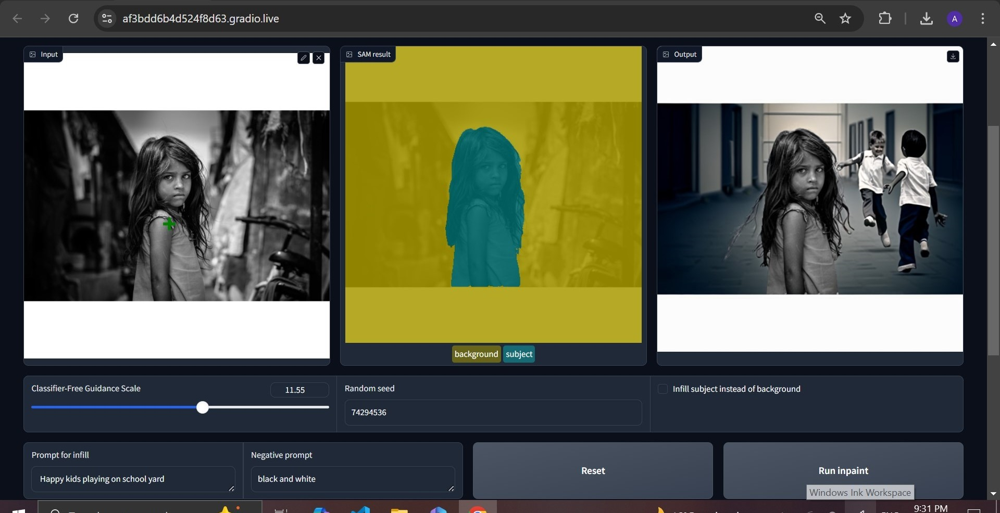

# SAM_text2image_diffusion

  

## Project Introduction

This project showcases the use of cutting-edge AI techniques to create an interactive tool for modifying images. It integrates the Segment Anything Model (SAM) for object selection and Stable Diffusion for generating creative replacements for backgrounds or subjects in images.

## Workflow

Upload Image: Upload an image.
Subject Selection: Select the main object by clicking on it. The Segment Anything Model (SAM) creates a segmentation mask around the selected object, choosing the most accurate mask generated.
Refine Mask: Review the mask and refine it further with additional points if needed.
Provide Prompt: Provide a text description (and possibly a negative prompt) to specify a new background for the selected object.
Generate New Background: The text-to-image diffusion model generate the new background.
Optional Subject Swap: Invert the mask and replace the subject while keeping the background.
